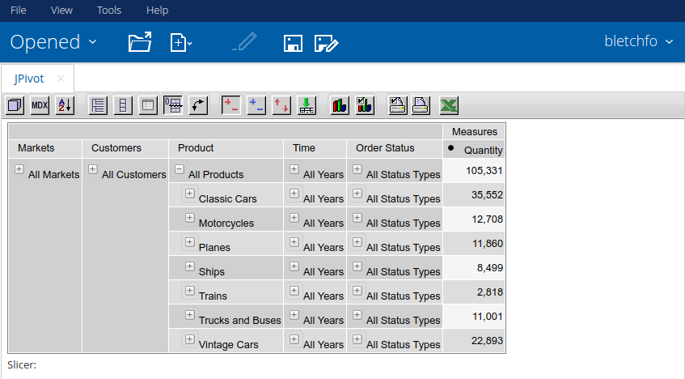

# Pentaho jPivot Plugin

This is a fork of [Pentaho's jPivot Plugin](https://github.com/pentaho/pentaho-platform-plugin-jpivot) patched for Pentaho 7+.

## Installing
Grab a built distribution from the [releases](https://github.com/DeBortoliWines/pentaho-platform-plugin-jpivot/releases) page and unzip it to `pentaho-solutions/system`

## Changelog
* [Fix error on save](https://github.com/DeBortoliWines/pentaho-platform-plugin-jpivot/commit/afbc6e8e06088edf174fba4025b4877acfbdd4c1).
* [Fix button sizes](https://github.com/DeBortoliWines/pentaho-platform-plugin-jpivot/commit/14259a93462ae0e8ebdbce4ad3bdfe9a9220209e).
